# linux_commands


## Beginner Linux Commands

<details>

<summary>1. mkdir : Used to make directory</summary>
<p>

**Syntax:**

```console
mkdir <directory_name>
```

**It will create a directory with name <directory_name>**

```console
mkdir -p <directory_name>/<directory_name2>
```

**It will create a directory with name <directory_name2> inside directory <directory_name>**

Example:

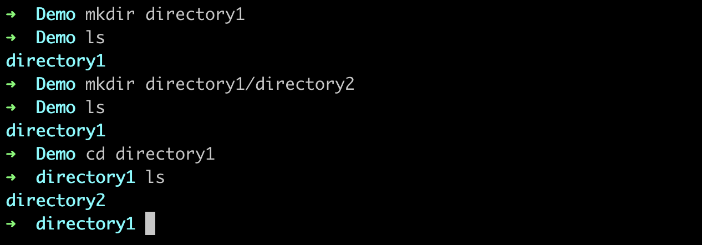

</p>

</details>

---

<details>
<summary>2. ls : Used to list all files and directories</summary>
<p>

**Syntax:**

```console
ls 
```

It will list all files and directories in current directory

```console
ls -a
```

It will list all files and directories including hidden files and directories

```console
ls -l
```
It will list all files and directories and their permissions

Example:

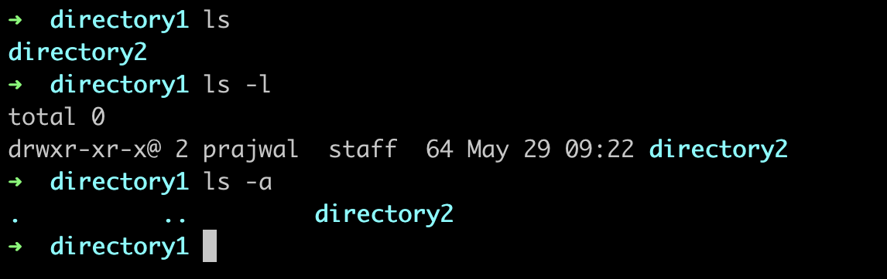

</p>

</details>

---

<details>
<summary>3. cd : Used to change directory</summary>
<p>

**Syntax:**

```console
cd <directory_name>
``` 
**It will change directory to <directory_name>**

```console
cd ..
cd ../..
```
**It will change directory to parent directory of current directory**


```console
cd ~
```
**It will change directory to home directory**

Example:

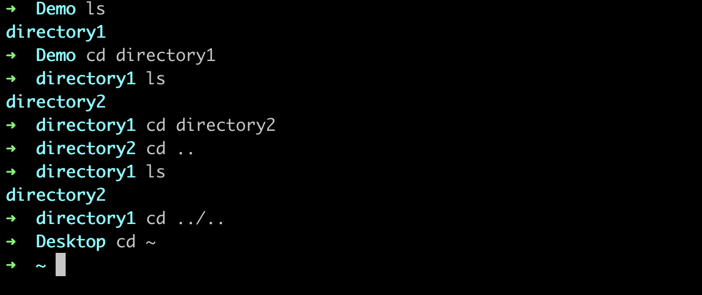

</p>

</details>

---

<details>
<summary>4. cat : Used to display contents of file</summary>

<p>

**Syntax:**

```console  
cat <file_name>
```
**It will display contents of file <file_name>**

```console
cat <file_name1> <file_name2>
```
**It will display contents of file <file_name1> and <file_name2>**

```console
cat <file_name1> <file_name2> > <file_name3>
```
**It will display contents of file <file_name1> and <file_name2> and store it in file <file_name3>**
    
Example:


</p>

</details>

---

<details>

<summary>5. touch : Used to create file</summary>

<p>

**Syntax:**

```console
touch <file_name>
```

**It will create a file with name <file_name>**

```console
touch <file_name1> <file_name2>
```

**It will create a file with name <file_name1> and <file_name2>**

Example:

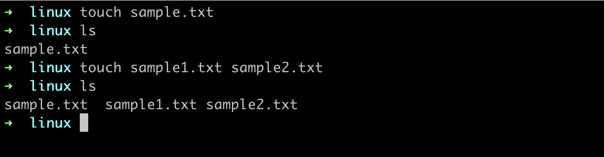

</p>

</details>

---

<details>

<summary>6. cp : Used to copy file or directory</summary>

<p>

**Syntax:**

```console
cp <file_name> <directory_name>
```

**It will copy file <file_name> to directory <directory_name>**

```console
cp <file_name1> <file_name2>
```
        
**It will copy file <file_name1> to file <file_name2>**

```console
cp -r <directory_name1> <directory_name2>
```

**It will copy directory <directory_name1> to directory <directory_name2>**


Example:

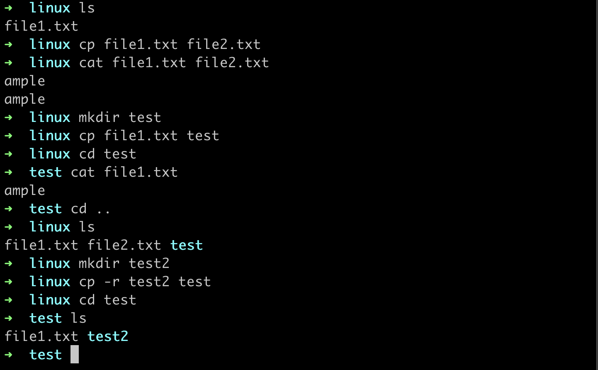

</p>    

</details>

---         

<details>

<summary>7. mv : Used to move file or directory</summary>

<p>

**Syntax:**

```console
mv <file_name> <directory_name>
```

**It will move file <file_name> to directory <directory_name>**

```console

mv <file_name1> <file_name2>
```

**It will move file <file_name1> to file <file_name2>**

```console
mv <directory_name1> <directory_name2>
```

**It will move directory <directory_name1> to directory <directory_name2>**


```console
mv <file_name> <file_name2>
```

**It will rename file <file_name> to <file_name2>**


Example:

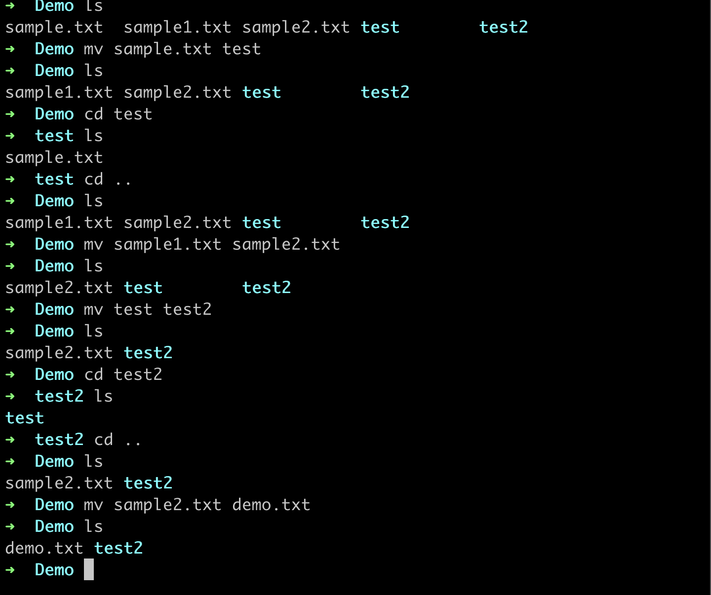

</p>

</details>

---

<details>

<summary>8. rm : Used to remove file or directory</summary>

<p>

**Syntax:**

```console
rm <file_name>
```

**It will remove file <file_name>**

```console

rm -r <directory_name>
```

**It will remove directory <directory_name>**

```console
rm -rf <directory_name>
```

**It will remove directory <directory_name> forcefully**

```console

rm -i <file_name>
```

**It will ask for confirmation before removing file <file_name>**

Example:

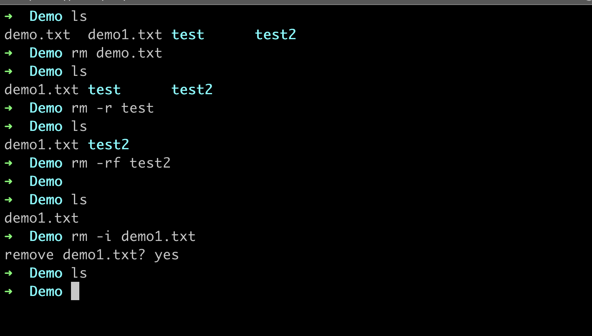

</p>

</details>

---

<details>

<summary>9. man: manual command</summary>

<p>

**Syntax:**

```console
man <command_name>
```

**It will display manual of command <command_name>**

</p>

</details>

---

<details>

<summary>10. open: opens the file or directory specified </summary>

<p>

**Syntax:**

```console
open <file_name>
```

**It will open file <file_name>**

```console

open .
```

**It will open the folder which you are in**

</p>

</details>

---

<details>

<summary>11. df  : Used to check tha available disk space </summary>

<p>

**Syntax:**

```console

df -h
```

**It will display the available disk space in human readable format**

**Example**

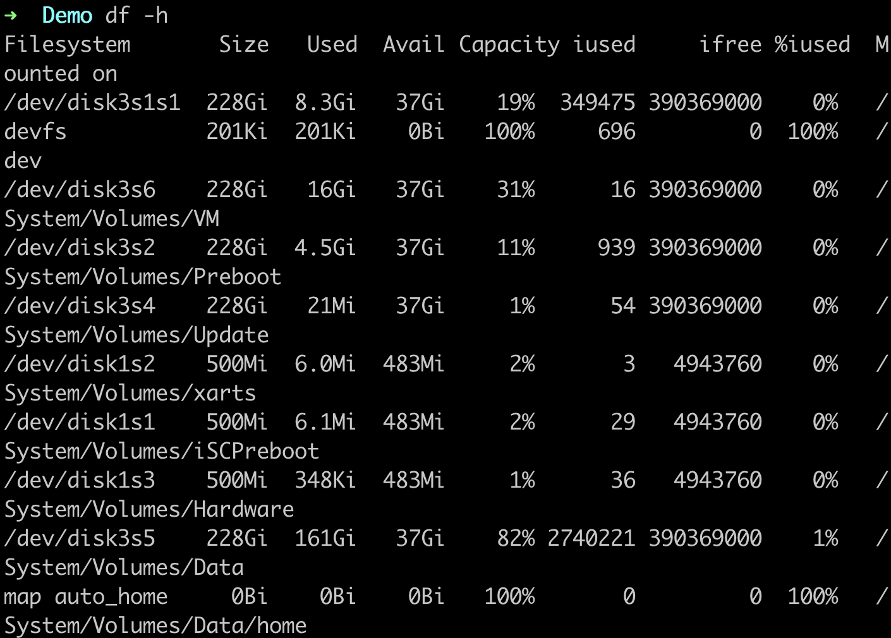

</p>

</details>

---

<details>   

<summary>12. du  : Used to check tha size of a file or directory </summary>

<p>

**Syntax:**

```console

du -sh <file_name>
```

**It will display the size of file <file_name> in human readable format**

```console

du -sh <directory_name>
```

**It will display the size of directory <directory_name> in human readable format**

**Example**

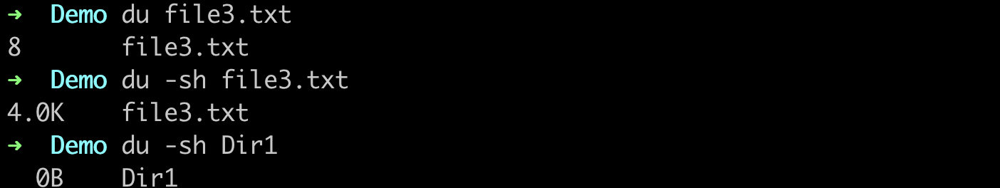

</p>

</details>


## Intermediate Linux Commands

<details>

<summary>13. grep: search for a string in a file</summary>

<p>

**Syntax:**

```console
grep <string> <file_name>
```

**It will search for string <string> in file <file_name>**

```console  
grep -i <string> <file_name>
```

**It will search for string <string> in file <file_name> ignoring case**

```console

grep -r <string> <directory_name>
```

**It will search for string <string> in directory <directory_name>**

```console

grep -v <string> <file_name>
```

**It will search for string <string> in file <file_name> and display lines which do not contain string <string>**

```console

grep -c <string> <file_name>
```

**It will search for string <string> in file <file_name> and display number of lines which contain string <string>**

```console


grep -n <string> <file_name>
```

**It will search for string <string> in file <file_name> and display line number of lines which contain string <string>**

```console

grep -w <string> <file_name>
```


**It will search for string <string> in file <file_name> and display lines which contain string <string> as a word**

```console

grep -A <number> <string> <file_name>
```

**It will search for string <string> in file <file_name> and display <number> lines after the line which contains string <string>**

```console

grep -B <number> <string> <file_name>
```


**It will search for string <string> in file <file_name> and display <number> lines before the line which contains string <string>**

```console

grep -C <number> <string> <file_name>
```

**It will search for string <string> in file <file_name> and display <number> lines before and after the line which contains string <string>**

Example:


</p>

</details>

---

<details>

<summary>14. chmod: change file permissions</summary>

<p>

**To find the permission of a file or directory, use `ls -l`**

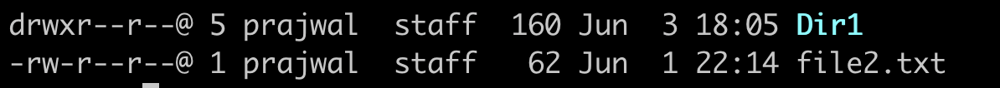

**`-rw-r--r--` is the permission of the file.**

**`-rw-` is the permission of the owner of the file.**

**`r--` is the permission of the group of the file.**

**`r--` is the permission of the others.**

**`r` means read permission.**

**`w` means write permission.**

**`x` means execute permission.**

**`-` means no permission.**

**r (read): 4**
**w (write): 2**
**x (execute): 1**
**- (no permission): 0**

**Syntax:**

```console
chmod <permission> <file_name>
```

**It will change the permission of file <file_name> to <permission>**

```console

chmod 777 <file_name>
```

**It will change the permission of file <file_name> to 777(all the access for all the users)**

```console

chmod 644 <file_name>
```

**It will change the permission of file <file_name> to 644(read and write access for owner and read access for group and others)**

**Example**

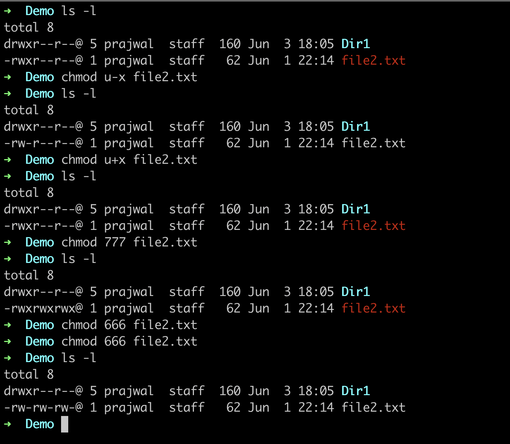

</p>

</details>

---

<details>

<summary>15. find: find files and directories</summary>

<p>

**Syntax:**

```console
find . -name <file_name>
```

**It will search for file <file_name> in current directory**

```console
find <directory_name> -name <file_name>
```

**It will search for file <file_name> in directory <directory_name>**

```console

find <directory_name> -iname <file_name>
```

**It will search for file <file_name> in directory <directory_name> ignoring case**

```console


find <directory_name> -type f
```

**It will search for files in directory <directory_name>**

```console

find <directory_name> -type d
```

**It will search for directories in directory <directory_name>**

```console

find <directory_name> -empty
```

**It will search for empty files and directories in directory <directory_name>**

```console

find <directory_name> -perm 777
```

**It will search for files and directories with permission 777 in directory <directory_name>**

```console

find <directory_name> -perm 777 -exec chmod 644 {} \;
```

**It will search for files and directories with permission 777 in directory <directory_name> and change their permission to 644**

```console

find <directory_name> -perm 777 -exec rm -rf {} \;
```

**It will search for files and directories with permission 777 in directory <directory_name> and remove them forcefully**

```console

find <directory_name> -perm 777 -exec cp -r {} <directory_name2> \;
```

**It will search for files and directories with permission 777 in directory <directory_name> and copy them to directory <directory_name2>**

```console

find <directory_name> -perm 777 -exec mv {} <directory_name2> \;
```

**It will search for files and directories with permission 777 in directory <directory_name> and move them to directory <directory_name2>**

```console

find <directory_name> -perm 777 -exec grep -i <string> {} \;
```

**It will search for files and directories with permission 777 in directory <directory_name> and search for string <string> in them**

```console

find <directory_name> -perm 777 -exec grep -i <string> {} \; -exec rm -rf {} \;
```

**It will search for files and directories with permission 777 in directory <directory_name> and search for string <string> in them and remove them forcefully**

**`-exec` is an option that indicates that a command should be executed on each matching file.**

**`{}` is a placeholder for the current file name.**

**`\;` is a separator indicating the end of the command, like ; in bash.**

Example:

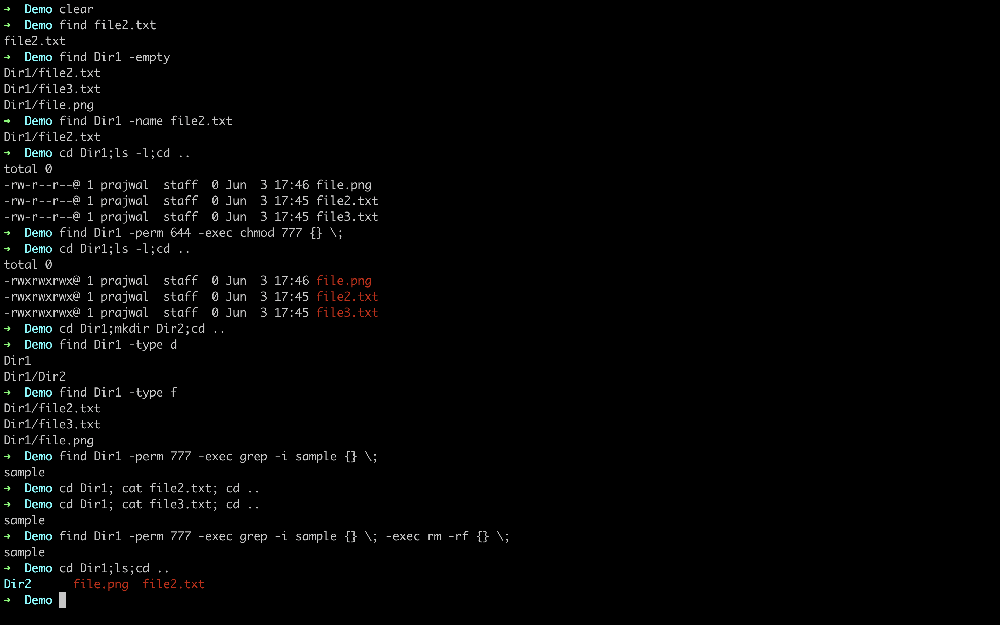

</p>

</details>

---

<details>

<summary>16. tr : Used to translate characters </summary>

<p>

**Syntax:**

```console

tr 'a-z' 'A-Z'
```

**It will translate all the characters from 'a' to 'z' to 'A' to 'Z'**

```console

tr -d 'a-z'
```

**It will delete all the characters from 'a' to 'z'**

```console


tr -d 'a-z' < file_name
```

**It will delete all the characters from 'a' to 'z' from file <file_name>**

```console

tr -d 'a-z' < file_name > file_name2
```

**It will delete all the characters from 'a' to 'z' from file <file_name> and save the output in file <file_name2>**


**Example**

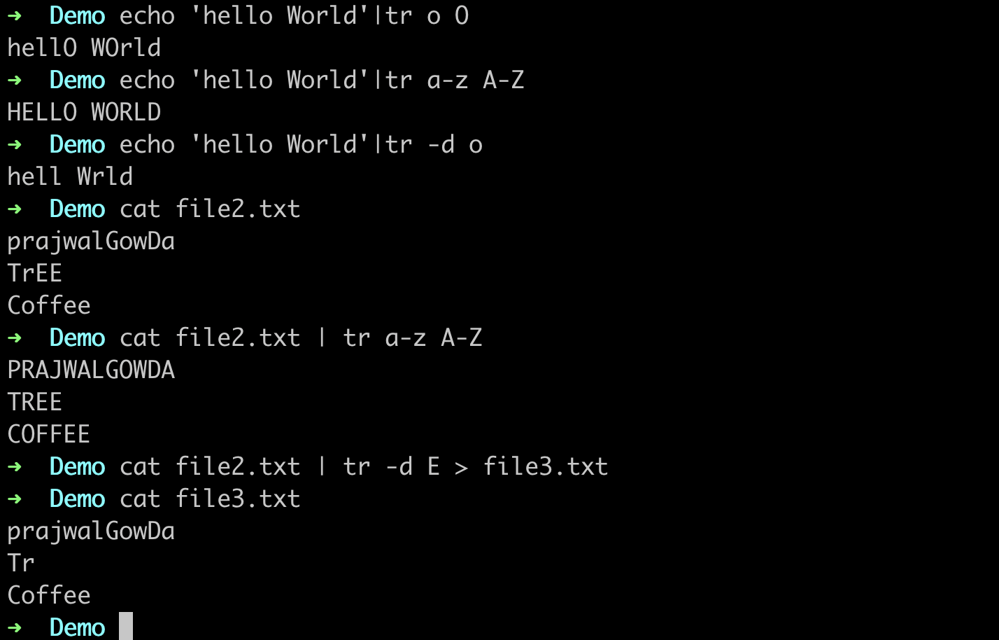

</p>

</details>

---

<details>

<summary>17. head: Used to print top n number of lines for given input </summary>

<p>

**Syntax:**

```console

head <file_name>
```

**It will print top 10 lines of file <file_name>**

```console

head -n <number> <file_name>
```

**It will print top <number> lines of file <file_name>**

```console

head -n <number> <file_name> > <file_name2>
```

**It will print top <number> lines of file <file_name> and save the output in file <file_name2>**

**Example**

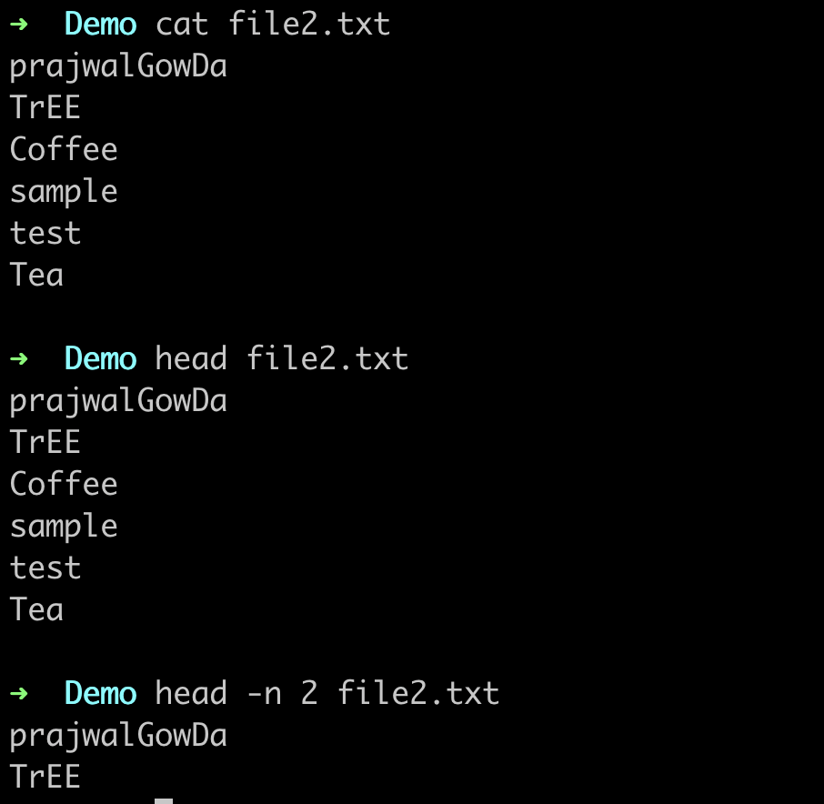

</p>

</details>

---

<details>

<summary>18. tail: Used to print last n number of lines for given input </summary>

<p>

**Syntax:**

```console

tail <file_name>
```

**It will print last 10 lines of file <file_name>**

```console

tail -n <number> <file_name>
```

**It will print last <number> lines of file <file_name>**

```console

tail -n <number> <file_name> > <file_name2>
```

**It will print last <number> lines of file <file_name> and save the output in file <file_name2>**

**Example**

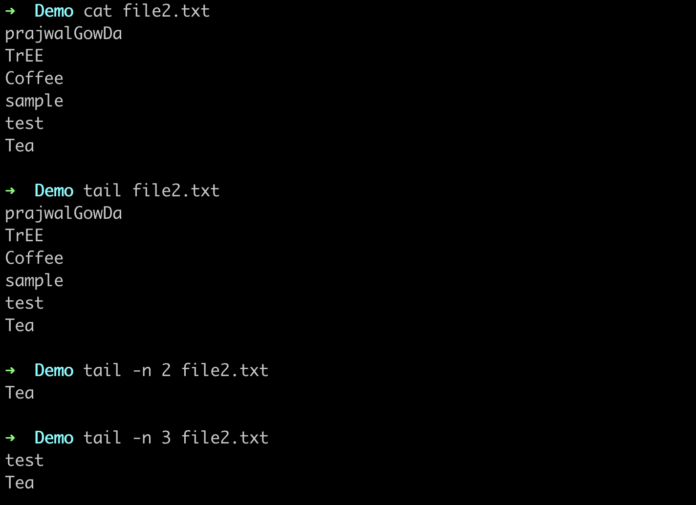

</p>

</details>

---

<details>

<summary>19. diff is used to display the differences in the files by comparing the files line by line</summary>

<p>

**Syntax:**

```console

diff <file_name1> <file_name2>
``` 

**It will display the differences in the files <file_name1> and <file_name2>**

```console

diff -y <file_name1> <file_name2>
```

**It will display the differences in the files <file_name1> and <file_name2> side by side**
**Example**

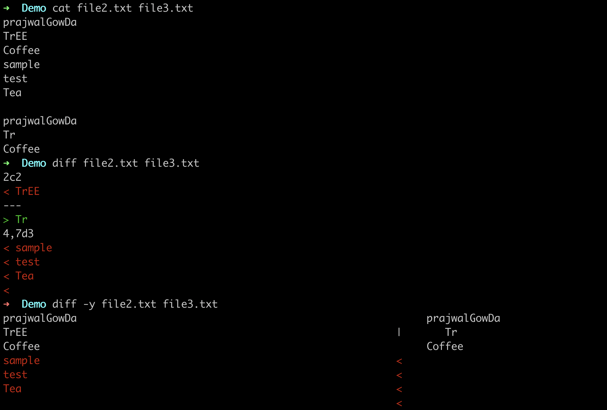

</p>

</details>

---

<details>

<summary>20. history: history command is used to view previously executed commands</summary>

<p>

**Syntax:**

```console

history
```
    
**It will display all the previously executed commands**

```console

history | grep <string>
```

</p>

</details>

---

<details>

<summary>21. alias: used to add alias to commands</summary>

<p>

**Syntax:**

```console

alias <alias_name>='<command>'
```

**It will add alias <alias_name> to command <command>**

```console

alias <alias_name>='<command>' >> ~/.bashrc
```

**It will add alias <alias_name> to command <command> in file ~/.bashrc**

**Example**

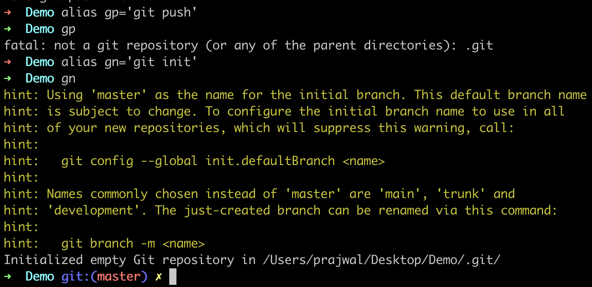

</p>

</details>

---

<details>

<summary>22. wget : Used to download teh files from teh server</summary>


<p>

**Syntax:**

```console

wget <url>
```

**It will download the file from the url <url>**

```console

wget -O <file_name> <url>
```

**It will download the file from the url <url> and save it as <file_name>**

```console  

wget -O <file_name> <url> -q
```

**It will download the file from the url <url> and save it as <file_name> and will not display any output**

```console

wget -b <url>
```

**It will download the file from the url <url> in background**

```console

wget -c <url>
```

**It will download the file from the url <url> and will resume the download if it is interrupted**

</p>

</details>


## Advanced Linux Commands

<details>

<summary>23. awk : A versatile text processing tool for extracting and manipulating data based on patterns and columns.</summary>

<p>

**Syntax:**

```console

awk '{print $1}' <file_name>
```

**It will print the first column of the file <file_name>**

```console

awk '{print $1,$2}' <file_name>
```

**It will print the first and second column of the file <file_name>**

```console

awk '{print $1,$2}' <file_name> > <file_name2>
```

**It will print the first and second column of the file <file_name> and save the output in file <file_name2>**

```console

awk '{print $1,$2}' <file_name> | sort
```

**It will print the first and second column of the file <file_name> and sort the output**

```console

awk '{print $1,$2}' <file_name> | sort -n
```

**It will print the first and second column of the file <file_name> and sort the output numerically**

```console
awk '{print NR,$0}' sample.txt
```

**It will print the line number and the line**

```console
awk '{print NF,$0}' sample.txt
```

**It will print the number of fields and the line**

```console

awk '{print $1,$2}' <file_name> | sort -n | uniq
```

**It will print the first and second column of the file <file_name> and sort the output numerically and remove the duplicate lines**

```console

awk '{print $1,$2}' <file_name> | sort -n | uniq -c
```

**It will print the first and second column of the file <file_name> and sort the output numerically and remove the duplicate lines and print the number of times each line is repeated**


**Example**

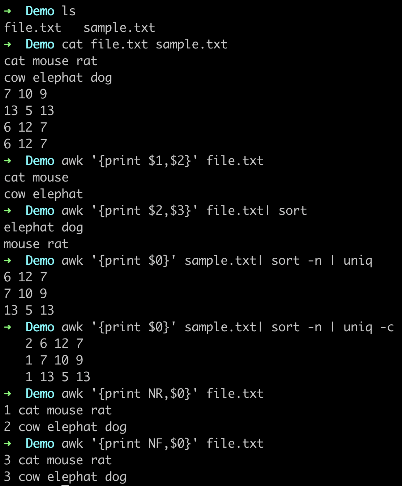


</p>


</details>

---

<details>

<summary>24. sed : A stream editor for searching, transforming, and modifying text based on regular expressions.</summary>

<p>

**Syntax:**

```console

sed 's/<string1>/<string2>/g' <file_name>
```

**It will replace all the occurences of <string1> with <string2> in the file <file_name>**

```console

sed 's/<string1>/<string2>/g' <file_name> | sort
```

**It will replace all the occurences of <string1> with <string2> in the file <file_name> and sort the output**

```console

sed 's/<string1>/<string2>/g' <file_name> | sort -n
```

**It will replace all the occurences of <string1> with <string2> in the file <file_name> and sort the output numerically**

```console

sed 's/<string1>/<string2>/g' <file_name> | sort -n | uniq
```

**It will replace all the occurences of <string1> with <string2> in the file <file_name> and sort the output numerically and remove the duplicate lines**

```console

sed 's/<sting1>/<string2>' <file_name>
```

**It will replace the first occurence of <string1> with <string2> in the file <file_name>**

```console

sed 's/<sting1>/<string2>/2' <file_name>
```

**It will replace the second occurence of <string1> with <string2> in the file <file_name>**

```console
sed '3 s/<string1>/<string2>/' <file_name>
```

**It will replace the first occurence of <string1> with <string2> in the third line of the file <file_name>**

```console
sed  's/<string1>/<string2>/p' <file_name>
```
**It will replace all the occurences of <string1> with <string2> in the file <file_name> and print the replaced line twice**

```console

sed 'nd' <file_name>
```

**It will delete the nth line**

```console

sed '/<string>/d' <file_name>
```

**It will delete all the lines containing <string>**

More examples:
https://www.geeksforgeeks.org/sed-command-linux-set-2/

**Example**

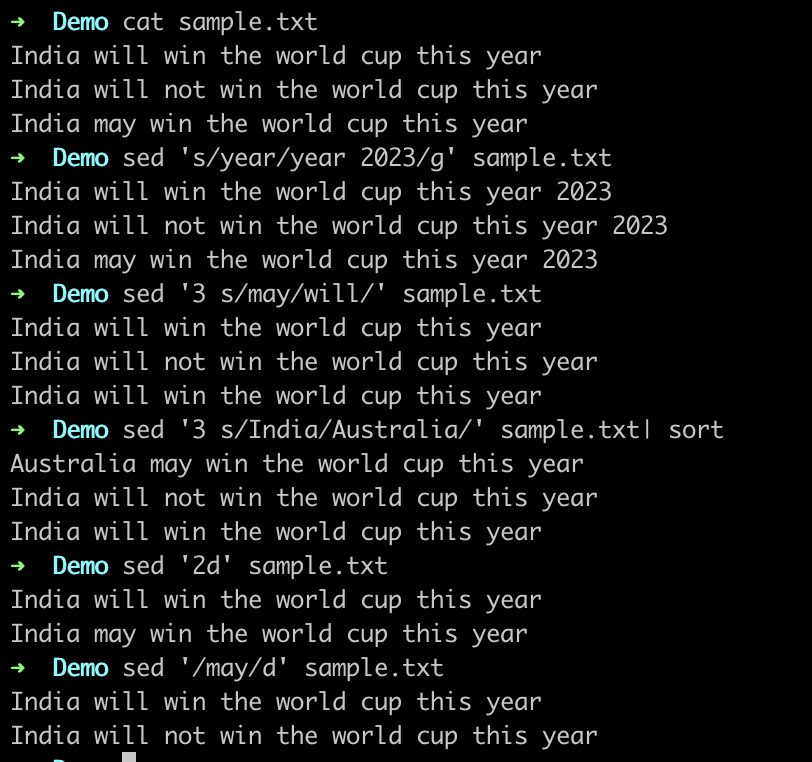

</p>

</details>

---

<details>

<summary>25. cut :  A tool for extracting specific fields or columns from lines of text based on a delimiter.</summary>

<p>

**Syntax:**

```console

cut -d '<delimiter>' -f <field_number> <file_name>
```

**It will print the <field_number> column of the file <file_name> with delimiter <delimiter>**

```console

cut -d '<delimiter>' -f <field_number1>,<field_number2> <file_name>
```

**It will print the <field_number1> and <field_number2> column of the file <file_name> with delimiter <delimiter>**

```console
cut -c <character_number> <file_name>
```

**It will print the <character_number> character of the file <file_name>**

```console

cut -c <character_number1>,<character_number2> <file_name>
```

**It will print the <character_number1> and <character_number2> character of the file <file_name>**

```console

cut -c <character_number1>-<character_number2> <file_name>
```

**It will print the characters from <character_number1> to <character_number2> of the file <file_name>**

```console  


cut -b <byte_number> <file_name>
``` 

**It will print the <byte_number> byte of the file <file_name>**

```console

cut -b <byte_number1>,<byte_number2> <file_name>
```

**It will print the <byte_number1> and <byte_number2> byte of the file <file_name>**

```console

cut -c 1- <file_name>
```

**It will print from the first character to the end of the file <file_name>**

```console

cut -c -<character_number> <file_name>
```

**It will print from the first character to the <character_number> character of the file <file_name>**

**Example**

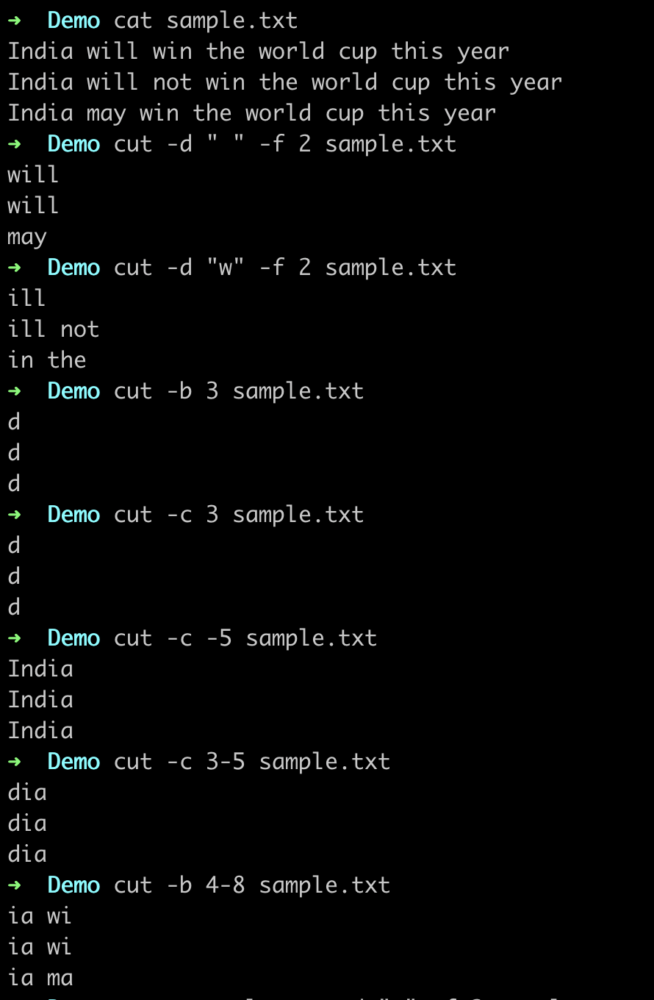

</p>

</details>

---


