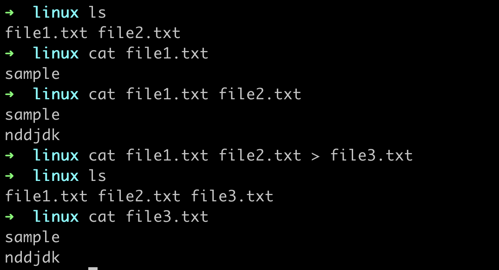

# linux_commands

## Beginner Linux Commands

<details>

<summary>mkdir : Used to make directory</summary>
<p>

**Syntax:**

```console
mkdir <directory_name>
```

**It will create a directory with name <directory_name>**

```console
mkdir -p <directory_name>/<directory_name2>
```

**It will create a directory with name <directory_name2> inside directory <directory_name>**

Example:


</p>

</details>

---

<details>
<summary>ls : Used to list all files and directories</summary>
<p>

**Syntax:**

```console
ls 
```

It will list all files and directories in current directory

```console
ls -a
```

It will list all files and directories including hidden files and directories

```console
ls -l
```
It will list all files and directories and their permissions

Example:


</p>

</details>

---

<details>
<summary>cd : Used to change directory</summary>
<p>

**Syntax:**

```console
cd <directory_name>
``` 
**It will change directory to <directory_name>**

```console
cd ..
cd ../..
```
**It will change directory to parent directory of current directory**


```console
cd ~
```
**It will change directory to home directory**

Example:


</p>

</details>

---

<details>
<summary>cat : Used to display contents of file</summary>

<p>

**Syntax:**

```console  
cat <file_name>
```
**It will display contents of file <file_name>**

```console
cat <file_name1> <file_name2>
```
**It will display contents of file <file_name1> and <file_name2>**

```console
cat <file_name1> <file_name2> > <file_name3>
```
**It will display contents of file <file_name1> and <file_name2> and store it in file <file_name3>**
    
Example:



</p>

</details>

---

<details>

<summary>touch : Used to create file</summary>

<p>

**Syntax:**

```console
touch <file_name>
```

**It will create a file with name <file_name>**

```console
touch <file_name1> <file_name2>
```

**It will create a file with name <file_name1> and <file_name2>**

Example:


</p>

</details>

---

<details>

<summary>cp : Used to copy file or directory</summary>

<p>

**Syntax:**

```console
cp <file_name> <directory_name>
```

**It will copy file <file_name> to directory <directory_name>**

```console
cp <file_name1> <file_name2>
```
        
**It will copy file <file_name1> to file <file_name2>**

```console
cp -r <directory_name1> <directory_name2>
```

**It will copy directory <directory_name1> to directory <directory_name2>**


Example:


</p>    

</details>

---         

<details>

<summary>mv : Used to move file or directory</summary>

<p>

**Syntax:**

```console
mv <file_name> <directory_name>
```

**It will move file <file_name> to directory <directory_name>**

```console

mv <file_name1> <file_name2>
```

**It will move file <file_name1> to file <file_name2>**

```console
mv <directory_name1> <directory_name2>
```

**It will move directory <directory_name1> to directory <directory_name2>**


```console
mv <file_name> <file_name2>
```

**It will rename file <file_name> to <file_name2>**


Example:


</p>

</details>

---

<details>

<summary>rm : Used to remove file or directory</summary>

<p>

**Syntax:**

```console
rm <file_name>
```

**It will remove file <file_name>**

```console

rm -r <directory_name>
```

**It will remove directory <directory_name>**

```console
rm -rf <directory_name>
```

**It will remove directory <directory_name> forcefully**

```console

rm -i <file_name>
```

**It will ask for confirmation before removing file <file_name>**

Example:


</p>

</details>

---

<details>

<summary>man: manual command</summary>

<p>

**Syntax:**

```console
man <command_name>
```

**It will display manual of command <command_name>**

</p>

</details>

---

<details>

<summary>open: opens the file or directory specified </summary>

<p>

**Syntax:**

```console
open <file_name>
```

**It will open file <file_name>**

```console

open .
```

**It will open the folder which you are in**

</p>

</details>


## Intermediate Linux Commands


